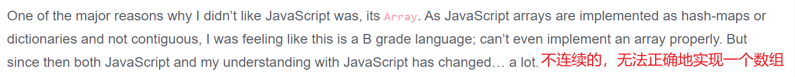
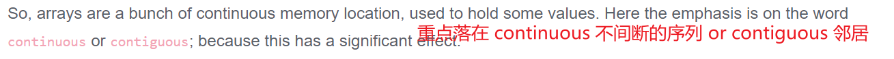
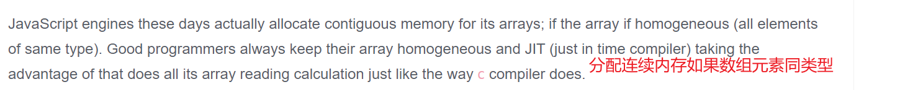

## 零、今日安排

- [x] 对 2021-12-27 至 2022-01-01 的学习总结
- [ ] 阅读《刀锋》

## 一、algorithm

### 1. 时间复杂度

时间复杂度的计算方式：

1. 加法常量改成 1
2. 只保留最高阶项
3. 最高阶项的常数乘量改为 1
4. 例：2n^2 + 5000000 = n^2

### 2. 数组解析

- 底层数组特征
  ```c
  // 以 C 为例
  double balance[5];
  ```
  1. 数组中必须存放相同类型的元素
  2. 申请数组的内存空间时，必须指定数组的大小
- 数组性能较低的原因
  1. 数组的扩容问题
     1. 需要重新申请一个数组，对原来数组扩大两倍
     2. 将原数组中的元素依次拷贝到新数组中
     3. 释放原数组
  2. 在数组的**前面 or 中间**位置**插入 or 删除**元素
     1. 元素位移
- [JavaScript 的数组实现解析](https://www.voidcanvas.com/javascript-array-evolution-performance/)
  - 翻完了，没太弄懂，但是作者好搞笑啊 hhhh
  - 直接上截图好了
    1. 最初 
    2. 问题 
    3. 改进 
    4. 持续改进到 `ArrayBuffer`: 不懂 2333

## 二、JavaScript

### 1. 函数解析与执行

1. 解析阶段
   ```js
   go: {
     foo: 0xaoo
   }
   foo(0xa00): {
     [[scope]]: parentScope,
     函数体: code
   }
   ```
2. 执行阶段

   ```js
   ECStack: [
     {全局代码},
     {
       foo: {
         FEContext: {
           VO: ao,
           [scope chain]: ao + parentScope, // 作用域链
           this: 该函数执行时动态绑定
         },
         [code execution]
       }
     }
   ]
   ```

3. 闭包 --> 内存泄漏
   - 闭包条件：
     1. 一个函数
     2. 访问外层作用域的自由变量
   - 解决内存泄漏：`fn = null`

### 2. Garbage Collection

1. 引用计数
2. 标记清除

### 3. this 绑定规则

1. 默认绑定
2. 隐式绑定
3. 显式绑定
   1. 绑定方式
      - call
      - apply
      - bind
   2. 对 `null` 和 `undefined` 的绑定 --> this 为 `window` 对象
4. new 绑定
   1. 创建一个全新的对象
   2. 对这个新对象执行 prototype 连接
   3. this 绑定
   4. 如果该函数没有返回其他值，则返回该对象
5. 内置函数
   1. `setTimeout`
      - 普通函数 --> 独立函数调用
      - 箭头函数 --> 外部作用域中的 this
   2. 监听事件(以点击事件为例)
      1. DOM1: `boxDiv.onclick = function() {}` --> `boxDiv.onclick()`，隐式绑定
      1. DOM2: `boxDiv.addEventListener('click', function() {})` --> 将函数放到一个数组中，然后显示绑定
   3. 数组 API
      1. 一般独立调用
      2. `[...].forEach(fn, thisArg)`: 另外绑定 thisArg
6. 箭头函数：跟随上层的 this
7. 间接函数引用：`(obj2.bar = obj1.foo)()` --> `window` 对象，实为独立函数调用

### 4. arguments

- array-like 对象
  1. 拥有数组的一些特性
     1. `arguments.length`
     2. `arguments[index]`
  2. 没有数组的一些方法：`forEach`, `map` 等
- `arguments.callee` --> 可获取原函数
- arguments 转为数组方法
  1. `forEach`
  2. `Array.prototype.slice.call(arguments)` or `[].slice.call(arguments)`
  3. `Array.from(arguments)`
  4. `[...arguments]`
